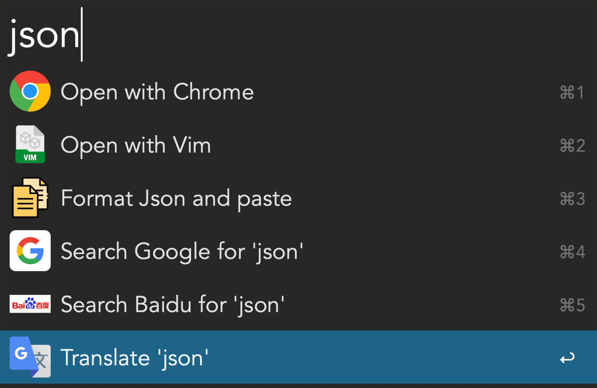
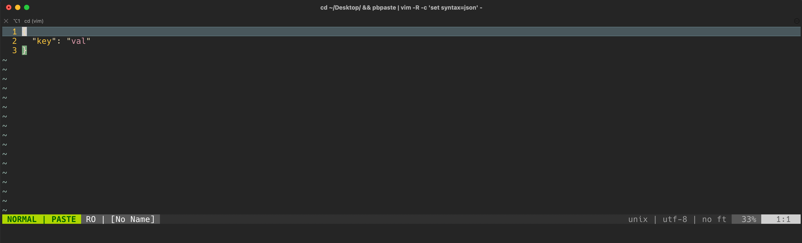
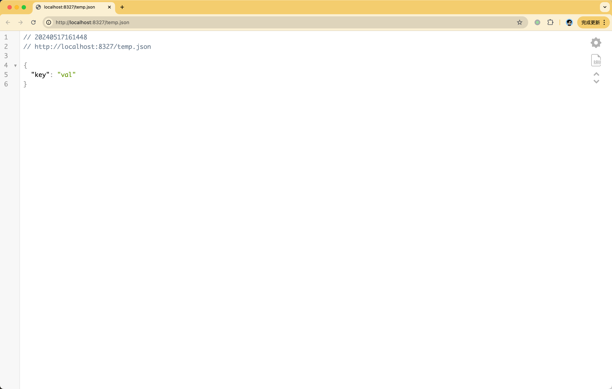
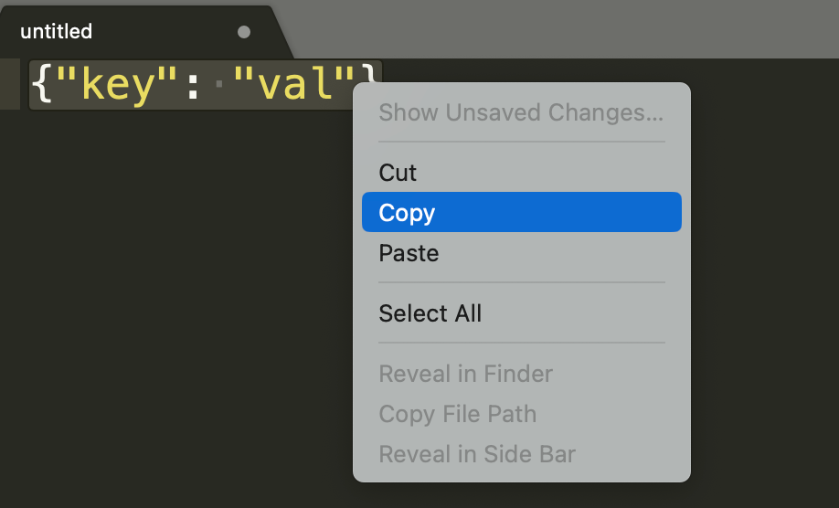

# alfred-json-view

View Json data from clipboard.

## 安装

1. 下载最新版本 [releases](https://github.com/liuweicode/alfred-json-view/releases)

2. 打开下载好的`.alfredworkflow`文件;

操作步骤：

1. 复制文本;

2. 快捷键调出 Alfred 输入框并输入`json`;

3. 选择列表中的其中一项:

 - Open with Vim. (格式化剪切板数据 - 打开iTerm.app - 打开vim编辑器 - 粘贴格式化后的Json文本)

 - Open with Chrome. (写入本地临时文件 - 使用Chrome打开文件)

 - Format Json and paste. （格式化剪切板数据并粘贴，需要将光标定位到要粘贴的输入框内）

